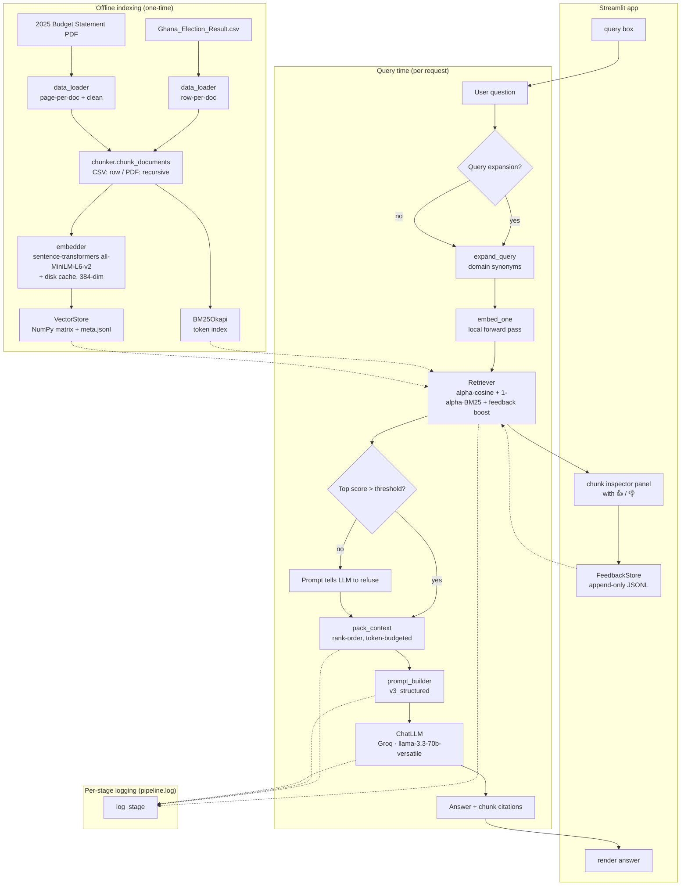

# Architecture & System Design

**Author:** `Andrew Kofi Kwakye`
**Index:** `10012300027`
**Covers:** Exam Part F

---

## 1. High-level diagram

## 2. Components & responsibilities

| Module                  | Responsibility                                            | Part(s) |
|-------------------------|-----------------------------------------------------------|---------|
| `src/data_loader.py`    | Load + clean CSV & PDF into uniform doc records           | A       |
| `src/chunker.py`        | 3 chunking strategies; `chunk_documents` routes per source| A       |
| `src/embedder.py`       | Local sentence-transformers embeddings + disk cache + L2 norm | B   |
| `src/vector_store.py`   | Hand-rolled NumPy ANN via dense matmul                    | B       |
| `src/retriever.py`      | Hybrid (dense + BM25) + feedback boost + query expansion  | B, G    |
| `src/prompt_builder.py` | 3 prompt templates + context-budget packing               | C       |
| `src/llm.py`            | Thin Groq chat wrapper (`llama-3.3-70b-versatile`)        | D       |
| `src/pipeline.py`       | End-to-end orchestrator, structured logging               | D       |
| `src/feedback.py`       | Persistent thumbs-up/down store → re-ranking boost        | G       |
| `src/evaluator.py`      | Adversarial test suite, RAG-vs-LLM comparison             | E       |
| `app.py`                | Streamlit UI                                              | Deliv.  |

## 3. Data flow narrative

**Offline (build-time).** `scripts/build_index.py` loads the CSV and PDF, cleans them (column normalisation, hyphen-join on PDF line breaks, duplicate / blank-row dropping), chunks them using a strategy picked per source (one-row-per-chunk for CSV, recursive character split on paragraph → sentence → word for PDF, 350 token target with 17 % overlap). Each chunk is embedded locally with `sentence-transformers/all-MiniLM-L6-v2` (384-dim). All vectors are L2-normalised and concatenated into a `(N, 384)` float32 matrix saved to `data/processed/embeddings.npy`. Metadata travels alongside in `meta.jsonl`. In parallel, a BM25 index is built in memory over the same token sequences.

**Online (request-time).** The user's question enters through Streamlit and is passed into `RAGPipeline.ask()`. Optional query expansion appends domain synonyms (e.g. `GDP` → `gross domestic product`). The question is embedded with the same sentence-transformers model (the `task_type` hint is kept in the API surface for forward compatibility, but has no effect on the local model). The retriever computes a dense cosine score and a BM25 score over the whole corpus, min-max normalises each into `[0, 1]`, and combines them with the hybrid weight `alpha`. A feedback-boost lookup adds a small clipped delta per chunk based on prior user votes. The top-k chunks are selected.

If the top combined score is below `CONFIG.min_score_threshold = 0.15`, the pipeline flags the request as low-confidence — the prompt then instructs the model to refuse rather than guess.

Chunks are framed with a citation header `[#i | source=... | score=...]` and packed greedily until the `CONFIG.max_context_tokens = 3000` budget is exhausted. The `v3_structured` prompt combines this context with the question and a procedural system prompt that mandates evidence-grounding, refusal when uncovered, and verbatim quoting of numbers and proper nouns.

The LLM (Groq's `llama-3.3-70b-versatile`, temperature 0.2) returns the answer. Every stage writes a structured JSON line to `logs/pipeline.log` so a reviewer can see the retrieved docs, their scores, and the exact prompt that was sent to the LLM.

**UI feedback loop.** The Streamlit app renders the answer and each retrieved chunk with a 👍 / 👎 button. Clicks append a row to `data/processed/feedback.jsonl` and update an in-memory score map. Because the retriever reads this map every request, feedback takes effect immediately for subsequent queries — no re-indexing required.

## 4. Why this design fits Academic City's domain

1. **Two document shapes, one retriever.** Ghana election results are *atomic relational records*; the 2025 Budget is *narrative policy prose*. A source-routed chunker preserves row semantics on one side and paragraph coherence on the other. A unified embedding + hybrid retriever then treats both in one similarity space.
2. **BM25 protects against the "short-record-loses-to-long-paragraph" failure.** Election rows are ~30 tokens; PDF paragraphs are 200–400 tokens. Pure cosine systematically under-ranks the shorter, information-denser rows because their vectors compete with long-form prose. BM25's IDF + length normalisation flips that for term-heavy queries (constituency names, party acronyms). This is exactly the failure Case 1 in `docs/retrieval_failures.md` documents.
3. **Refusal > hallucination in a government-data context.** Budget and election numbers are the kind of facts a confidently-wrong answer is most damaging for (they get quoted in essays, news, and Twitter threads). The confidence gate + v3 prompt pushes the system toward refusal when uncertain; this is measured in the Part E evaluation as a reduction in hallucination rate vs. the pure-LLM baseline.
4. **Auditability is required for academic use.** Per-stage logging and citation-by-chunk-id means anyone reviewing an answer can trace it back to the exact budget paragraph or CSV row. This matters when the tool is used by students writing essays or faculty preparing lectures.
5. **No framework lock-in, low operational cost.** The vector store is a single `.npy` file; the metadata is `.jsonl`. Streamlit Cloud can cold-start the whole stack from a GitHub clone, load `embeddings.npy` into RAM, and serve queries with one Groq chat call per question. Embeddings run locally on CPU via sentence-transformers, so there is no embedding-provider rate limit or cost. Groq's free tier covers chat inference for grading. For a 60-mark academic project the operational complexity is negligible and there's no vendor coupling — swapping to OpenAI or back to Gemini would require changing only `src/embedder.py` and `src/llm.py`.

## 5. Failure modes & mitigations

| Failure                                              | Mitigation                                                                        |
|------------------------------------------------------|-----------------------------------------------------------------------------------|
| Topically-related but wrong chunks ranked top        | Hybrid BM25 component rewards term co-occurrence; feedback loop pushes them down. |
| PDF text extraction produces gibberish on a page     | `data_loader._clean_page_text` fixes hyphen breaks and drops pages < 50 chars.    |
| Model invents numbers when context is thin           | v3 prompt bans non-verbatim numbers; confidence gate tells model to refuse.       |
| Feedback signal abused to pin an irrelevant chunk    | `feedback_cap` clamps total contribution so it cannot outweigh semantic score.    |
| Slow first-query embedder load                       | First call lazy-loads the sentence-transformers model (~80 MB); disk cache avoids re-embedding anything after that. |

## 6. Known limitations (honest)

- The feedback store is **query-agnostic**: a chunk that is up-voted for one question boosts it for *all* future queries. A production version would cluster queries and scope the boost to similar clusters.
- BM25 is rebuilt in memory at startup — fine for a 50k-chunk corpus, not for millions.
- The current refusal threshold is a single global constant (`0.15`); ideally it would be calibrated per source (CSV scores typically run lower than PDF scores because CSV rows are short).

These are discussed in the video walkthrough as "what I'd fix next".
